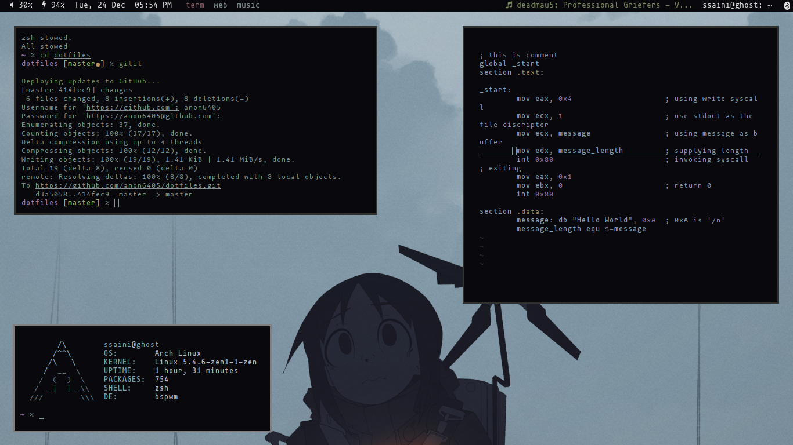

# dot-files
Dot files for my setup (bspwm, rofi, compton, neovim, i3blocks, polybar, lockscreen, i3[not using anymore])



# To replicate
```shell
$ git clone https://github.com/anon6405/dotfiles.git
$ sudo pacman -S stow (use your choice of package manager)
$ cd dotfiles
$ stow *
```
That's all
